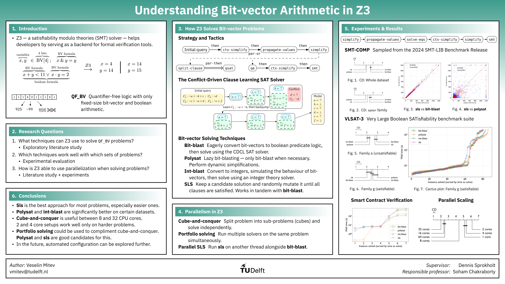

# Benchmarking Bit-vector Arithmetic in Z3

[](https://doi.org/10.5281/zenodo.15848281)

This is the repository associated with my Bachelors Thesis in Computer Science and Engineering for Delft University of Technology: [Understanding Bit-vector Arithmetic in Z3](https://resolver.tudelft.nl/uuid:79fcf0ae-37e6-4a1c-8f09-1d83afa826be).

[](https://cse3000-research-project.github.io/static/217c9788b195d00bea69b0f00486fc9a/poster.pdf)

> Satisfiability modulo theories solvers serve as the backbone of software verifiers, static analyzers, and proof assistants; the versatile bit-vector arithmetic theory is particularly important for these applications. As solvers continue to be developed, they become more capable but also more difficult to configure optimally. The widely-used Z3 prover offers a multitude of configurable techniques for solving bit-vector problems, however, the pace of development has not allowed for a comprehensive comparative analysis of them. We study the available bit-vector algorithms and parallelization methods, on established sets of problems. Through an experimental evaluation, we find that properly configuring Z3 for a specific use case can have significant effects on performance. We offer guidance to developers on how to go about that, which should help to make formal verification tools more efficient.

This complimentary repository contains benchmarking code tailored to [SLURM](https://slurm.schedmd.com/)-based High-Performance Computing (HPC) systems. It also contains data analysis and visualization code. Paired with the [associated Zenodo record](https://zenodo.org/records/15848281), datasets, and [Docker image](https://hub.docker.com/repository/docker/vesk4000/z3-benchmarks); this should contain everything needed to reproduce and validate the experiments in the paper. This repository may also be help if you are trying to benchmark Z3 (or other software) for your own experiments on a SLURM supercomputer.

Do note that this repository has not been extensively documented or tested. It is not a standalone piece of software; more information about all the experiments and the theoretical background can be found in the associated paper. Its main purpose was to serve as one-off code that I was using while working on my thesis. Some of the code and file paths may need to be tuned to work for your particular use case or SLURM setup. Some basic familiarity with SLURM-based HPC is assumed.

## Setup
1. Clone the repository in the scratch folder of your HPC machine.
2. Download the datasets, unzip them, and put them in the `datasets` folder of the repository (you can also put different datasets in different places, but you will have to modify some file paths in the code). Your system should have the necessary commands, or if not, they should be in some SLURM module:
   - SMT-LIB 2024 QF_BV
      ```shell
      mkdir -p datasets
      cd datasets
      wget -O QF_BV.tar.zst "https://zenodo.org/records/11061097/files/QF_BV.tar.zst?download=1"
      tar -I zstd -xf QF_BV.tar.zst
      rm QF_BV.tar.zst
      ```
   - VLSAT-3
      ```shell
      cd datasets
      mkdir -p VLSAT3
      wget -r --no-parent -A "vlsat3_a*.smt2.bz2" https://cadp.inria.fr/ftp/benchmarks/vlsat/ -P VLSAT3
      wget -r --no-parent -A "vlsat3_g*.smt2.bz2" https://cadp.inria.fr/ftp/benchmarks/vlsat/ -P VLSAT3
      find VLSAT3 -name "*.smt2.bz2" -exec bunzip2 {} +
      cd ..
      ```
   - Smart Contract Verification
      ```shell
      cd datasets
      mkdir -p Smart_Contract_Verification
      wget -O Smart_Contract_Verification/artifact.tar.gz "https://zenodo.org/records/5652826/files/artifact.tar.gz?download=1"
      tar -xzf Smart_Contract_Verification/artifact.tar.gz -C Smart_Contract_Verification
      tar -xzf Smart_Contract_Verification/artifact/benchmarks/full/qfbv.tar.gz -C Smart_Contract_Verification/
      rm Smart_Contract_Verification/artifact.tar.gz
      rm -rf Smart_Contract_Verification/artifact
      cd ..
      ```
3. Make a conda environment for the project:
   ```shell
   module load miniconda3 # Load the conda module (this may vary depending on your SLURM cluster) every time you use conda
   
   conda create -n z3-benchmarking-env python=3.10.18 -y
   conda activate z3-benchmarking-env # Active any time you want to run the benchmarks
   
   conda install -c conda-forge numpy=1.26.4 pandas=1.5.3 matplotlib-base=3.10.0 scipy=1.15.3 scikit-learn=1.6.1 -y
   conda install -c conda-forge orange3=3.32.0 -y
   pip install ijson==3.4.0 z3-solver==4.15.1.0 pysmt==0.9.6
   ```
4. Setup the two Z3 versions via a Docker container on the SLURM machine using the provided Docker image:
   ```shell
   module load apptainer
   
   # Pull the Docker image and convert to Apptainer SIF format
   apptainer pull z3-benchmarks.sif docker://vesk4000/z3-benchmarks:v3
   CONTAINER=$(realpath z3-benchmarks.sif)
   echo "export CONTAINER=$CONTAINER" >> ~/.bashrc
      
   # Create z3 wrapper script
   mkdir -p ~/bin
   cat > ~/bin/z3 << 'EOF'
   #!/usr/bin/env bash
   if [[ "${1:-}" == "--poly" ]]; then
      shift
      exec apptainer exec $CONTAINER z3-poly "$@"
   else
      exec apptainer exec $CONTAINER z3 "$@"
   fi
   EOF
   chmod +x ~/bin/z3
   export PATH="$HOME/bin:$PATH"
   echo 'export PATH="$HOME/bin:$PATH"' >> ~/.bashrc
   
   # Test the setup
   z3 --version          # Should see "Z3 version 4.15.1 - 64 bit"
   z3 --poly --version   # Should see "Z3 version 4.13.1 - 64 bit"
   ```

## Running Benchmarks

1. Update SLURM parameters in the `sbatch-scripts` (partition, account, path, etc.) to match your cluster configuration:
   - `#SBATCH --partition=desired-partition`
   - `#SBATCH --account=your-account` 
   - `cd /scratch/username/repository-path`
2. Run the SLURM scripts in `sbatch-scripts/`:
   ```shell
   mkdir -p logs # If we don't create the logs folder, the SLURM scipts will fail only after they have waited in the queue
   for script in sbatch-scripts/*.sh; do
      sbatch "$script"
   done
   ```
   You can ignore the warning `sbatch: This job submission specifies multiple tasks, but it doesn't use 'srun' to run multiple tasks.` We run `srun` in the `benchy.py` script rather than directly in the SLURM scripts, so this is expected.

## Analysis & Visualization

### Download existing results
In case you do not wish to run the benchmarks yourself, you can get the results from my experiments from [the associated Zenodo record](https://zenodo.org/records/15848281):

```shell
mkdir -p results
cd results
wget -O results.tar "https://zenodo.org/records/15848281/files/results.tar?download=1"
tar -xf results.tar
rm results.tar
cd ..
```

### Visualize results

In the `main` function of `plot_results.py` you can change the `OPT` variable to select which set of results to visualize:
- `SMT-COMP`
- `VLSAT3g`
- `VLSAT3a`
- `smart-contracts`
- `parallel-scaling`

If you are using your own results, some tweaking would be required, since you need to specify the exact location of each set of results.

Once you have configured the desired set of results to analyze, you can run:
```shell
python plot_results.py
```

A number of different plots will be generated:
   - `quantile.svg`: Cactus plot showing solver performance
   - `scatter_*.svg`: Pairwise solver comparisons  
   - `critical_difference.svg`: Statistical significance analysis
   - `histogram_family_binned_performance.svg`: Performance by benchmark family (only applicable for the SMT-COMP 2024 dataset)

There are a few other scripts in the repository used to prepare the task files for the benchmarks, and to analyze the results of the hyperparameter search. The `extract_qfbv_stats.py` script requires the JSON-formatted results of the SMT-COMP 2024 non-incremental QF_BV track. It's a big file, so it wasn't included in the repository.
